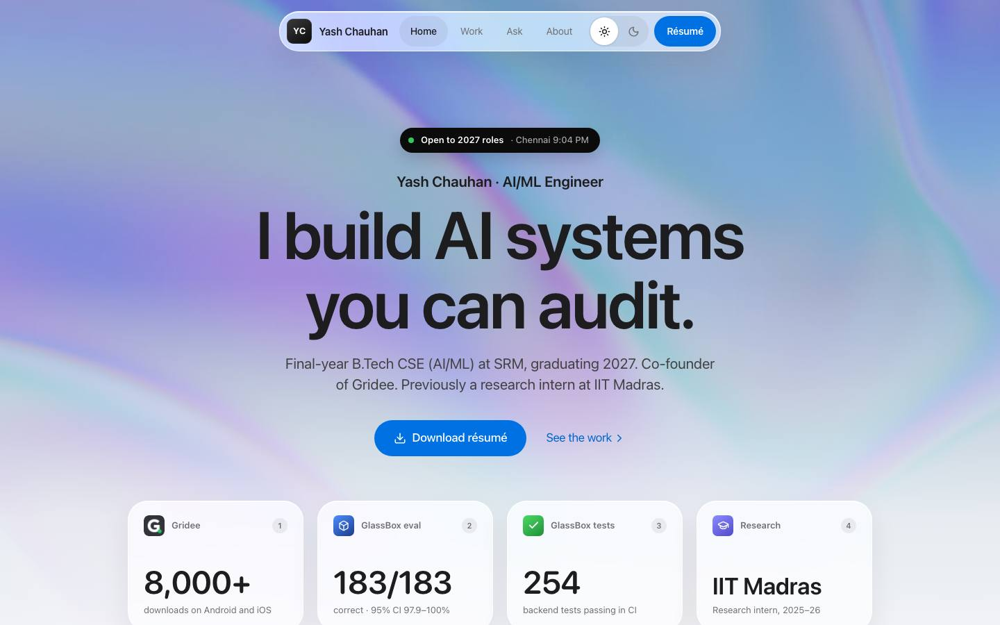
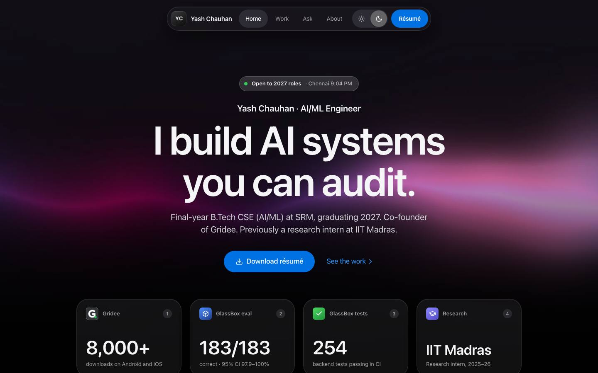
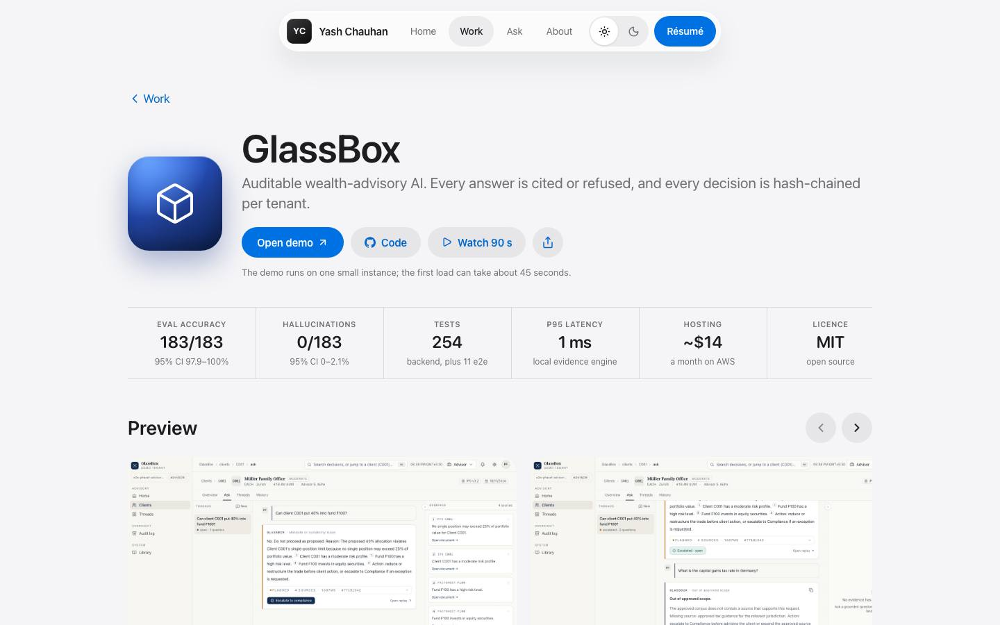
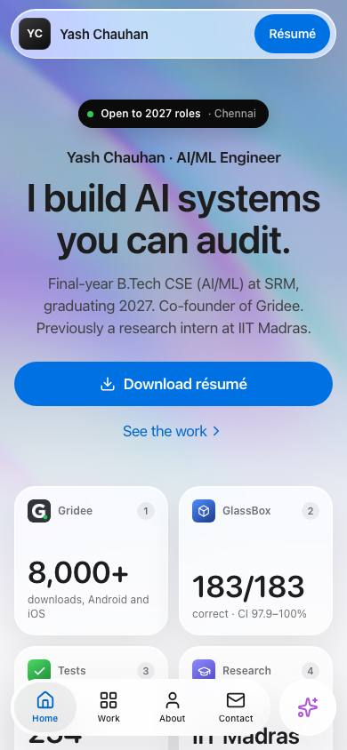
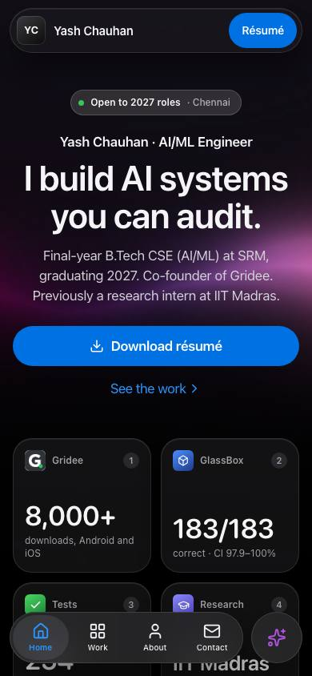

# Glass: the portfolio design

**Final, approved Oct 4, 2026.** A portfolio built like an iOS app, where every number can be checked: SF Pro, iOS colours and materials, React Bits backgrounds and components, light and dark mode, desktop and phone.

- **Design canvas** (private, Claude Design): https://claude.ai/artifact/U371MceJ9TvQNAXSAMqjaT. It opens on *Glass — Pages*.
- **Spec:** [`portfolio.design.md`](portfolio.design.md). **Build plan:** [`IMPLEMENTATION.md`](IMPLEMENTATION.md).
- **See it without the canvas:** open [`prototype/index.html`](prototype/index.html) in a browser, or browse [`screenshots/`](screenshots/).

| Light | Dark |
|---|---|
|  |  |

| Case study | Phone, light | Phone, dark |
|---|---|---|
|  |  |  |

## What's in this folder

| Folder or file | What it is | Use it to |
|---|---|---|
| [`portfolio.design.md`](portfolio.design.md) | The design spec: concept, tokens, page templates, the component-to-library map, accessibility, performance, licences | Decide how anything should look or behave |
| [`IMPLEMENTATION.md`](IMPLEMENTATION.md) | Stack setup, install commands, build order, page reference, React Bits settings, launch checklist | Build the site |
| [`screenshots/`](screenshots/) | Every artboard rendered to an image, plus the interactive components in their open states | Compare your build against the design |
| [`prototype/`](prototype/) | Every artboard as standalone HTML (open `index.html`) | Inspect exact sizes, colours and spacing in browser dev tools |
| [`tokens/`](tokens/) | `tokens.css` (light, dark, accents), `tailwind.css` (Tailwind v4 theme and utilities), `tokens.json` | Drop the design system into the app |
| [`starter/`](starter/) | Content files (projects, sources, experience, toolkit, Ask answers), logic (Ask matcher, Wilson interval, local time) and React components (hero background, source sheet, Ask panel, theme switch, lists, chips) | Start the build with tested, type-checked pieces |
| [`assets/`](assets/) | Hero background stills, project screenshots, the Gridee icon, with provenance and licences | Put real images on the pages |
| [`artifact/`](artifact/) | A byte-for-byte copy of the canvas files (`canvas.json` and every `.dc.html` artboard) | Keep the canvas in git; restore or diff it |
| [`source/`](source/) | The generator that produced the artboards, prototypes, tokens and screenshots | Change the design later and regenerate everything |

## The pages

| Artboard | Size | Screenshot | Prototype |
|---|---|---|---|
| Home, light (Iridescence) | 1440 × 7160 | [home-light.jpg](screenshots/home-light.jpg) | [GlassHome.html](prototype/GlassHome.html) |
| Home, dark (Soft Aurora) | 1440 × 7160 | [home-dark.jpg](screenshots/home-dark.jpg) | [GlassHomeDark.html](prototype/GlassHomeDark.html) |
| Case study, GlassBox, light | 1440 × 7540 | [case-study-light.jpg](screenshots/case-study-light.jpg) | [GlassCase.html](prototype/GlassCase.html) |
| Case study, GlassBox, dark | 1440 × 7540 | [case-study-dark.jpg](screenshots/case-study-dark.jpg) | [GlassCaseDark.html](prototype/GlassCaseDark.html) |
| Work index | 1440 × 1930 | [work-index.jpg](screenshots/work-index.jpg) | [GlassWork.html](prototype/GlassWork.html) |
| Phone, first screen, light / dark | 390 × 844 | [light](screenshots/mobile-first-screen-light.jpg) · [dark](screenshots/mobile-first-screen-dark.jpg) | [light](prototype/GlassMobileFirst.html) · [dark](prototype/GlassMobileFirstDark.html) |
| Phone, home, full scroll | 390 × 5420 | [mobile-home.jpg](screenshots/mobile-home.jpg) | [GlassMobile.html](prototype/GlassMobile.html) |
| Phone, case study, dark | 390 × 3040 | [mobile-case-study-dark.jpg](screenshots/mobile-case-study-dark.jpg) | [GlassMobileCaseDark.html](prototype/GlassMobileCaseDark.html) |
| Tokens | 1440 × 4000 | [tokens.jpg](screenshots/tokens.jpg) | [GlassTokens.html](prototype/GlassTokens.html) |
| Components (interactive on the canvas) | 1440 × 2300 | [default](screenshots/components.jpg) · [open states](screenshots/components-open-states.jpg) | [GlassComponents.html](prototype/GlassComponents.html) |

The prototypes are static: buttons and sheets are drawn, not wired. The canvas's Components board is interactive (press Play), and `starter/` has the real behaviour.

## Decided

- Direction **Glass**, as drawn. Accent **Blue** (`#0071E3`). Hero backgrounds **Iridescence** (light) and **Soft Aurora** (dark).
- Still open, and not blocking the build: Ask v1 (no server, recommended) or v2 (retrieval + LLM); a profile photo; the facts listed in the repo README under "Facts only you can confirm".

## Licences in one line each

React Bits: MIT + Commons Clause (use inside the site; don't resell the components). Lucide: ISC. Simple Icons: CC0, marks belong to their owners. Inter: OFL. SF Pro: system font only, never shipped. Details in [`portfolio.design.md`](portfolio.design.md) §12 and [`assets/README.md`](assets/README.md).
